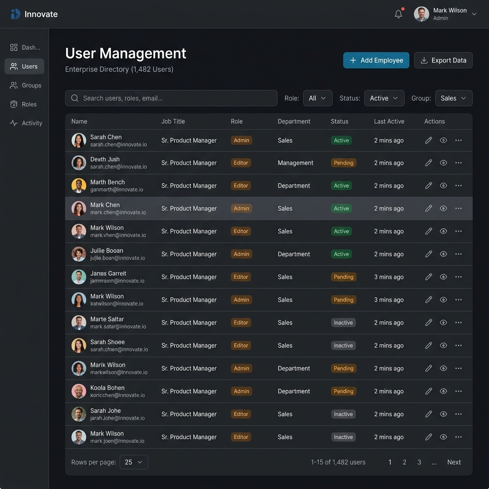

<div align="center">
  <h1>🚀 NSQTech Enterprise HR & Admin Dashboard</h1>
  <p>A full-stack, highly scalable, enterprise-grade admin portal featuring JWT authentication, real-time metrics, dynamic user management, and an aesthetic dark-themed UI built with Angular and Node.js.</p>

  <p>
    <a href="https://modern-hr-admin-dashboard.vercel.app"><strong>Live Frontend (Vercel)</strong></a> ·
    <a href="https://modern-hr-admin-dashboard-production.up.railway.app/api/v1/health"><strong>Live Backend (Railway)</strong></a>
  </p>
</div>

<hr />

## 🌟 Overview

The **NSQTech Enterprise HR & Admin Dashboard** is a comprehensive solution designed to handle internal operations, compliance records, and employee management. It was engineered from the ground up to be **production-ready**, boasting a secure REST API backend and an ultra-modern, responsive, matte-themed Angular frontend.

This project was built with a strong focus on:
- **Enterprise-Grade Architecture**: Clean monorepo structure separating concerns into distinct, highly scalable micro-environments.
- **Production-Ready Security**: Best-practice JWT authentication with HttpOnly cookies, CORS protection, and strict rate-limiting.
- **Premium User Experience**: Silky smooth animations, a glassmorphic dark theme, skeleton loaders, and a responsive grid layout.

## 📸 Platform Previews

### Dashboard & Analytics
The executive dashboard provides high-level metrics, API health monitoring, and project allocation charts.


### User Management
A comprehensive data table handling employee statuses, secure passwords, and department assignments.


### Secure Authentication
A sleek login portal protected by rate-limiters and JWT validation.


---

## 🛠 Tech Stack & Architecture

### Frontend (Deployed on Vercel)
- **Framework**: Angular 18+ (Standalone Components, Signals for State Management)
- **UI Library**: Angular Material 15+ (MDC-based components)
- **Styling**: SCSS / Vanilla CSS with custom design tokens (Dark Theme)
- **Data Visualization**: Chart.js
- **Features**: Command Palette, Global Search, Export to PDF/CSV, Route Guards, Interceptors.

### Backend (Deployed on Railway)
- **Runtime**: Node.js & Express.js
- **Architecture**: Modular MVC (Routes, Controllers, Middleware, Utils)
- **Security**: `helmet`, `cors`, `express-rate-limit`, JWT Auth
- **Database**: Configured for MongoDB integration (currently running highly scalable mock-data fallback for immediate demoing).
- **Features**: Request Validation, Centralized Error Handling, Secure Password Hashing (bcrypt).

---

## ⚙️ Core Enterprise Features

1. **Robust Authentication System**
   - JWT-based login with secure fallbacks.
   - Route protection for admin-only vs general user views.
   - Persistent session management.

2. **Advanced Data Management**
   - Paginated, sortable, filterable Angular Material data tables.
   - Dynamic user creation and editing forms.
   - Quick-status updates.

3. **Infrastructure Monitoring**
   - Real-time `ApiHealthService` polling the backend.
   - Visual API status indicators directly in the UI.
   - Graceful offline error states and skeleton loaders.

4. **Premium UI/UX System**
   - Custom staggered fade animations.
   - Intelligent command palette (`Ctrl+K`).
   - "Empty State" and "Error State" customized components.

---

## 🚀 Live Demo & Credentials

You can view the fully operational deployed application here:
👉 **[Launch Live Demo](https://modern-hr-admin-dashboard.vercel.app)**

### Test Credentials
To access the dashboard, use the following administrator credentials:

- **Email**: `admin@nsqtech.com`
- **Password**: `admin123`

*(The database resets mock data periodically to ensure a clean state for all viewers).*

---

## 💻 Local Installation & Development

This repository uses a monorepo layout. You need two separate terminals to run the system locally.

### 1. Clone the repository
```bash
git clone https://github.com/yashwanth-sri-sai/modern-hr-admin-dashboard.git
cd modern-hr-admin-dashboard
```

### 2. Start the Backend API
```bash
cd backend
npm install
npm run dev
```
*The API will start on `http://localhost:3000`.*

### 3. Start the Frontend Application
```bash
cd frontend
npm install
npm start
```
*The Angular app will start on `http://localhost:4200` and proxy requests to the backend.*

---

## 🛡 API Architecture Overview

The Node.js Express application exposes the following secured REST endpoints:

- `POST /api/v1/auth/login` - Authenticate and retrieve token.
- `GET /api/v1/health` - Public endpoint for uptime monitoring.
- `GET /api/v1/users` - Retrieve paginated user directory.
- `POST /api/v1/users` - Register a new employee.
- `GET /api/v1/dashboard/stats` - Fetch aggregate platform metrics.

---
<div align="center">
  <i>Engineered for Performance. Built for the Enterprise.</i>
</div>
