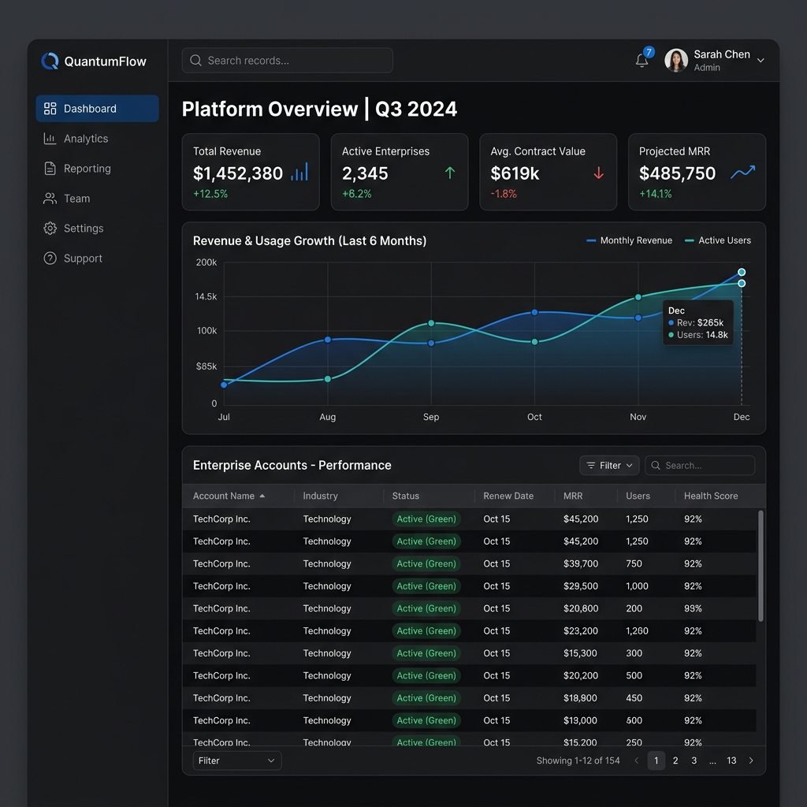
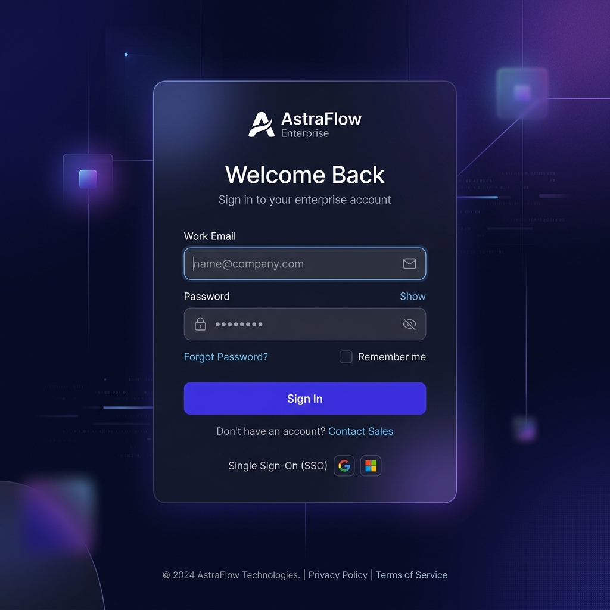

# Modern HR Admin Dashboard — Enterprise SaaS Portal

An enterprise-grade, high-performance SaaS admin dashboard built as a showcase for modern frontend engineering. This portal features a standalone Angular 21 architecture with Signals, a secured Node.js/Express.js backend, role-based access control (RBAC), sophisticated UI/UX motion design, and robust security protections.

## 📸 Screenshots

### Dashboard Experience


### Profile & Account Management


### Cinematic Enterprise Authentication


---

## 🛠️ Technology Stack & System Requirements

| Layer | Technology | Version | Purpose |
|---|---|---|---|
| **Frontend** | Angular | v21.2.x | SPA framework (Signals, standalone components, lazy routing) |
| | Angular Material | v21.2.x | Material Design 3 core UI library |
| | SCSS | Latest | Custom stylesheets, variables, and dark/light Material themes |
| | RxJS | v7.8.x | Stream processing, event debouncing, and HTTP pipelines |
| **Backend** | Node.js | v24.14.x | Lightweight, high-concurrency javascript engine |
| | Express.js | v4.19.x | REST API server with middleware router |
| **Database** | lowdb | v7.0.x | Flat-file JSON database (`db.json`) |
| **Auth** | JWT | `jsonwebtoken` | Stateless session bearer tokens |
| | bcryptjs | v2.4.x | One-way password hashing (salt rounds: 10) |

---

## 🚀 Quick Start Guide

### Step 1: Initialize the Node.js API Server
```bash
cd backend
npm install
npm run dev
```
* **Local Listener**: `http://localhost:3000`
* **Health Check**: `http://localhost:3000/api/health`
* **V1 Base URL**: `http://localhost:3000/api/v1`

### Step 2: Initialize the Angular Client
```bash
cd frontend
npm install
npx ng serve --open
```
* **Client Portal**: `http://localhost:4200`
* **Hot-Reloading**: Watcher triggers incremental compilation within 0.5s.

### Troubleshooting a blank / white page

1. **Run both servers** — backend on port `3000` and frontend on port `4200`.
2. **Hard refresh** the browser: `Ctrl + Shift + R` (or clear cache for `localhost:4200`).
3. **Clear stale auth data** (DevTools → Application → Local Storage → remove `nsq_auth_*` keys), then reload.
4. If port `4200` is stuck, stop old Node processes and restart:
   ```powershell
   Get-NetTCPConnection -LocalPort 4200,3000 -ErrorAction SilentlyContinue |
     ForEach-Object { Stop-Process -Id $_.OwningProcess -Force -ErrorAction SilentlyContinue }
   ```
5. Open `http://localhost:4200/auth/login` — you should see the **Welcome back** login form.

---

## 🔑 Demo Access Credentials

The database is pre-seeded with bcrypt-hashed credentials. You can click the **Demo Credentials** quick-fill cards on the login page to populate these automatically:

| Role | Username / User ID | Password | Display Name | Permissions |
|---|---|---|---|---|
| **Administrator** | `admin` | `admin123` | Super Admin | Full CRUD (User Management, Stats, Records) |
| **General User** | `yash` | `yash123` | Yash | Read-Only (Dashboard Stats & Records table) |

---

## 🏗️ Architecture Overview & Design Patterns

The application conforms to standard enterprise layers, separating concerns cleanly:

```text
modern-hr-admin-dashboard/
├── frontend/                     # Standalone Angular 21 Application
│   ├── proxy.conf.json           # Dev server proxy (/api -> http://localhost:3000)
│   └── src/app/
│       ├── core/                 # App-wide singleton providers
│       │   ├── guards/           # RBAC guards (AuthGuard, AdminGuard)
│       │   ├── interceptors/     # Http filters (Bearer Token injection, Global spinner, 401 Catchers)
│       │   └── services/         # State engines (AuthService, LoadingService, ThemeService)
│       ├── shared/               # Reusable dumb components & pipes
│       │   ├── components/       # ErrorState, EmptyState, Command Palette, SkeletonLoader
│       │   └── pipes/            # Custom utility pipes
│       ├── layouts/              # Routing outlets (AuthLayout, ShellLayout)
│       ├── auth/                 # Lazy-loaded login screen
│       ├── dashboard/            # Lazy-loaded metrics & record table views
│       ├── profile/              # User profile and settings management
│       └── admin/                # Lazy-loaded user creation & audit logs (RBAC protected)
└── backend/                      # Express.js REST API
    ├── data/
    │   └── db.json               # lowdb JSON flat-file database
    └── src/
        ├── routes/               # API route maps (auth, users, records)
        ├── controllers/          # Validation and request adapters
        ├── services/             # CRUD queries, hashing, and business logic
        ├── middleware/           # RBAC permissions, JWT verify, structured errors
        └── utils/                # lowdb database loader & JWT tools
```

### Key Architectural Decisions
1. **Angular Signals State Management**: Instead of heavy state managers (like NgRx), this application uses native Angular Signals to coordinate reactive properties, resulting in instant UI updates with zero change detection overhead.
2. **Strict ChangeDetectionStrategy.OnPush**: Used globally to ensure maximum rendering performance.
3. **Versioned API Gateway**: All backend endpoints are versioned under `/api/v1` to follow enterprise maturity standards.

---

## ✨ Enterprise Feature List

* **Secure Authentication Flow**: Fully mocked JWT-based stateless authorization with route guards, role interception, and automatic session expiration handling.
* **Role-Based Access Control (RBAC)**: Separate permissions for `Administrator` vs `General User`, dynamically shifting routing and sidebar visibility.
* **Advanced Table Systems**: Fully functional Angular Material tables with sorting, filtering, sticky headers, quick-actions, and pagination.
* **Premium Dashboard Analytics**: Responsive Chart.js integrations with floating stat cards driven by a robust mock API.
* **Command Palette**: A keyboard-driven (Ctrl+K) command palette for rapid navigation, global searching, and executing quick actions across the platform.
* **Dynamic Exporting**: Built-in functionality to export table states to CSV and PDF formats using client-side generation.
* **Cinematic UX & Motion Design**: Highly refined micro-animations, matte dark-mode surfaces, staggered fade effects, and zero layout shift loading states (Skeletons).
* **Dual Theme Engine**: Seamless toggling between light mode and a deep matte dark mode built on CSS custom variables.

---

## 🔒 Security Hardening Review

1. **Helmet.js Integration**: Automatically sets HTTP headers to protect against clickjacking, MIME sniffing, and cross-site scripting (XSS).
2. **CORS Configuration**: Restricts API calls strictly to trusted origins (`http://localhost:4200`).
3. **Stateless JWT Authorization**: Signs tokens using `HS256` with an 8-hour expiry. Tokens are transmitted inside the `Authorization: Bearer <token>` header.
4. **Self-Deletion Protection**: Prevents admins from deleting their own accounts (validated both in the database service and disabled on the table control UI).
5. **Dynamic 401 Logout**: If a session expires, the interceptor immediately wipes local session values and triggers a redirect to the login screen with a Warning Snackbar.

---

## 🚀 UX Polish & Micro-Animations

* **Dark & Light Themes**: The navbar features an animated theme-switching control that saves preference states inside `localStorage`. CSS transitions animate theme toggles smoothly.
* **Skeleton Cards**: Shimmer components show skeleton outlines for tables and charts during network calls to prevent cumulative layout shifts (CLS).
* **Glassmorphic Styling**: Elegant backdrops, subtle border gradients, and blurred cards create a modern SaaS application style.
* **Friendly UX fallbacks**: Handles blank filters and connection timeouts gracefully via custom `ErrorState` and `EmptyState` panels.

---

## 🧪 Pre-Submission Quality Checklists

### 1. Functional QA Verification
- [x] Verify that hitting `/app` without a token redirects to `/auth/login`.
- [x] Verify that logging in as General User (`yash`) redirects to Dashboard and hides "User Management" from the sidebar.
- [x] Verify that General User cannot hit `/app/admin` via direct URL typing (redirects to Dashboard).
- [x] Verify that Administrator (`admin`) sees "User Management" and can create/update/delete users.
- [x] Verify that Admin cannot delete their own row (the button is disabled and displays a warning tooltip).

### 2. Technical Performance Checklist
- [x] Run `npm run build` inside `frontend/` to confirm zero compilation warnings or type-mismatch errors.
- [x] Open Chrome DevTools and verify that no unhandled console errors occur.
- [x] Verify that lazy-load routing splits bundle outputs (e.g. `login-component`, `dashboard-component` bundles are loaded dynamically).
- [x] Ensure that rate-limiting blocks requests on spamming endpoints.
- [x] Confirm theme states persist cleanly across page reloads.
